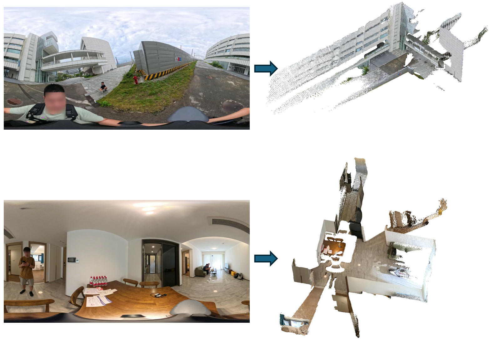
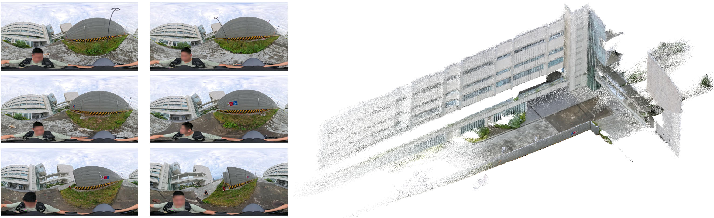

# Pi3 Panorama Inference

This repository provides the Pi3 panorama reconstruction inference pipeline together with demo scripts for panorama-to-point-cloud reconstruction.

## Reconstruction Examples

<p align="center">
  
  
</p>

<p align="center">
  <em>Left: single-panorama reconstruction. Right: multi-panorama reconstruction.</em>
</p>

## Checkpoints

Pretrained checkpoints are available on Hugging Face:

[ouou123/Holo360D ckpt](https://huggingface.co/datasets/ouou123/Holo360D/tree/main/ckpt)

## Installation

```bash
pip install -r requirements.txt
```

This also installs the bundled `utils3d` package in editable mode.

## Demo Variants

We provide two panorama splitting variants:

- `8views`: eight horizontal perspective views.
- `10views`: eight horizontal perspective views plus two additional vertical views (up and down).

### Recommended use

- Use the `8views` model for panorama multi-view reconstruction.
  The pose estimation of this split strategy is the most stable, and the views complement each other well enough to provide full coverage across multiple panoramas.
- Use the `10views` model for single-view panorama reconstruction.
  This setup is designed for reconstructing a single panorama and does not rely on estimating poses across multiple panoramas.

## Demo Scripts

- `360_inference_8views.bash`: example script for the 8-view pipeline.
- `360_inference_10view.bash`: example script for the 10-view pipeline.

## Inference

The main inference entry point is:

```bash
python 360_inference.py \
  --ckpt <path_to_checkpoint> \
  --rgb_dir <path_to_rgb_dir> \
  --mask_dir <optional_mask_dir> \
  --output_dir ./ply_outputs \
  --view_type 8views \
  --conf_keep_percent 0.5
```

Optional sky segmentation can be enabled with:

```bash
--mask_sky
```

See `360_inference.py --help` for the full argument list.

## Sample Data

We provide indoor and outdoor sample data under:

```text
/dev_vepfs/fly/temp/Pi3-inference/assets
```

The sample folders include both:

- `rgb`
- `mask`

For custom data, only `rgb` is required. The `mask` input is optional.

## Output

The inference pipeline saves the following outputs under `./ply_outputs`:

- merged point cloud
- camera poses

