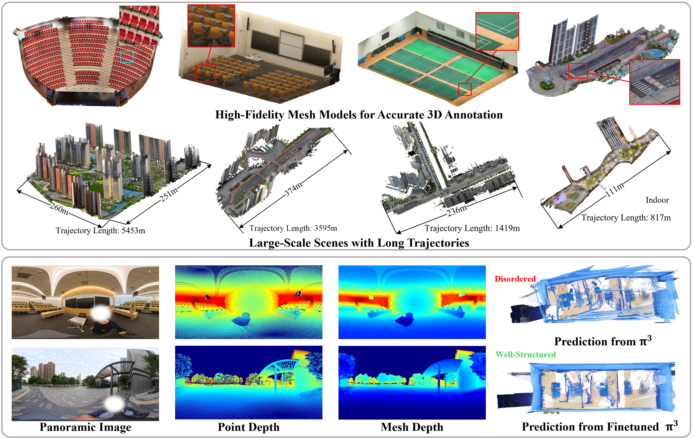

<h1 align="center">Holo360D: A Large-Scale Real-World Dataset with Continuous Trajectories for Advancing Panoramic 3D Reconstruction and Beyond</h1>

<div align="center">
  <a href="https://jou719.github.io/Holo360D_homepage/"></a> &ensp;
  <a href="https://arxiv.org/pdf/2604.22482"></a> &ensp;
  <a href="https://github.com/Jou719/Holo360D/tree/main"></a> &ensp;
  <a href="https://huggingface.co/datasets/ouou123/Holo360D/tree/main"></a> &ensp;
</div>

<div align="center">
  
</div>

## 🎉 NEWS
- [2026.06.03] 🔥 We have released test data of the **Holo360D** dataset on Hugging Face, featuring 13 indoor scenes and 4 outdoor scene.

---

## ✨ Overview

While feed-forward 3D reconstruction models have advanced rapidly, they still suffer from notable performance degradation on panoramic inputs due to spherical distortions. Existing panoramic datasets are also mostly captured at discrete camera positions, which limits support for continuous multi-view trajectory learning.

**Holo360D** is introduced to address these limitations. According to the paper, it contains **10w+ panoramas** with aligned geometry annotations, and is designed to support panoramic 3D reconstruction research with continuous trajectories in real-world scenes.

Key characteristics (from the paper):
- Large-scale real-world 360 panorama dataset.
- Continuous trajectory capture for multi-view settings.
- Accurately aligned high-completeness depth maps for panoramic 3D learning.
- A benchmark setup for model fine-tuning and evaluation.

## 📦 Dataset Structure
```
Holo360D/
├── train/
│   ├── Indoor_xxx/
│   │   ├── rgb/                # panoramic RGB images (.jpg)
│   │   ├── depth/              # depth maps (.exr)
│   │   ├── mask/               # masks (.jpg)
│   │   ├── rgb_mask/           # RGB-masked panoramas (.jpg)
│   │   └── poses/              # camera poses (.txt)
│   ├── Indoor_xxx/
│   ├── Outdoor_xxx/
│   │   ├── rgb/                # panoramic RGB images (.jpg)
│   │   ├── depth/
│   │   │   ├── mesh_depth/             # depth maps (.exr)
│   │   │   ├── pointcloud_depth/       # depth maps (.exr)
│   │   │   ├── visual_mesh_depth/      # visualization (.jpg)
│   │   │   └── visual_pointcloud_depth/# visualization (.jpg)
│   │   ├── mask/               # masks (.jpg)
│   │   ├── rgb_mask/           # RGB-masked panoramas (.jpg)
│   │   └── poses/              # camera poses (.txt)
│   ├── Outdoor_xxx/
│   └── ...
└── test/
    ├── Indoor_xxx/
    │   ├── rgb/
    │   ├── depth/
    │   ├── mask/
    │   ├── rgb_mask/
    │   └── poses/
    ├── Indoor_xxx/
    ├── Outdoor_xxx/
    │   ├── rgb/
    │   ├── depth/
    │   │   ├── mesh_depth/
    │   │   ├── pointcloud_depth/
    │   │   ├── visual_mesh_depth/
    │   │   └── visual_pointcloud_depth/
    │   ├── mask/
    │   ├── rgb_mask/
    │   └── poses/
    ├── Outdoor_xxx/
    └── ...
```

Notes:
- Timestamp-like file names are shared across modalities to support frame-level alignment.

## 💡 Dataset Download

Detailed download links and full-package release plan are **to be released**.

- [Hugging Face](https://huggingface.co/datasets/ouou123/Holo360D/tree/main)
- Full dataset: to be released

## 🚀 Quick Start

Loading scripts and official preprocessing/evaluation pipeline are **to be released**.

A minimal usage example (placeholder) will be provided in future updates.

## 📬 Contact

If you have any other questions, you can open an issue on GitHub or contact us via email at jou719@connect.hkust-gz.edu.cn.

## Citation
If you find this dataset useful, please cite our paper.

```bibtex
@article{ou2026holo360d,
  title={Holo360D: A Large-Scale Real-World Dataset with Continuous Trajectories for Advancing Panoramic 3D Reconstruction and Beyond},
  author={Ou, Jing and Cao, Zidong and Ren, Yinrui and Li, Zhuoxiao and Zhu, Jinjing and Hua, Tongyan and Zhang, Shuai and Xiong, Hui and Zhao, Wufan},
  journal={arXiv preprint arXiv:2604.22482},
  year={2026}
}
```
